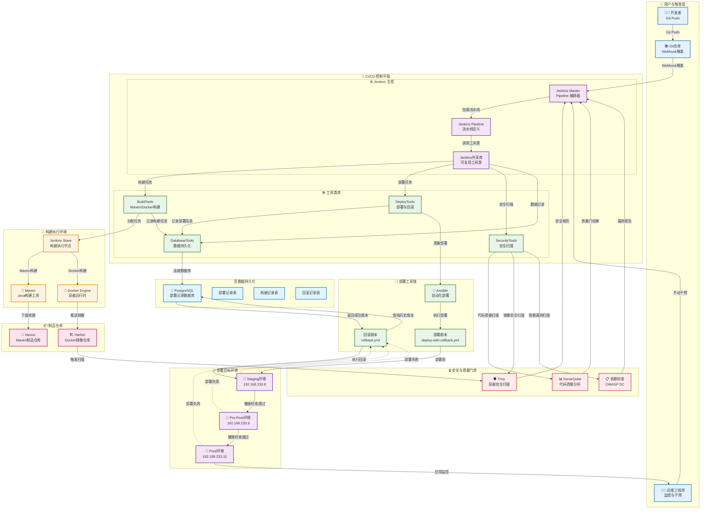
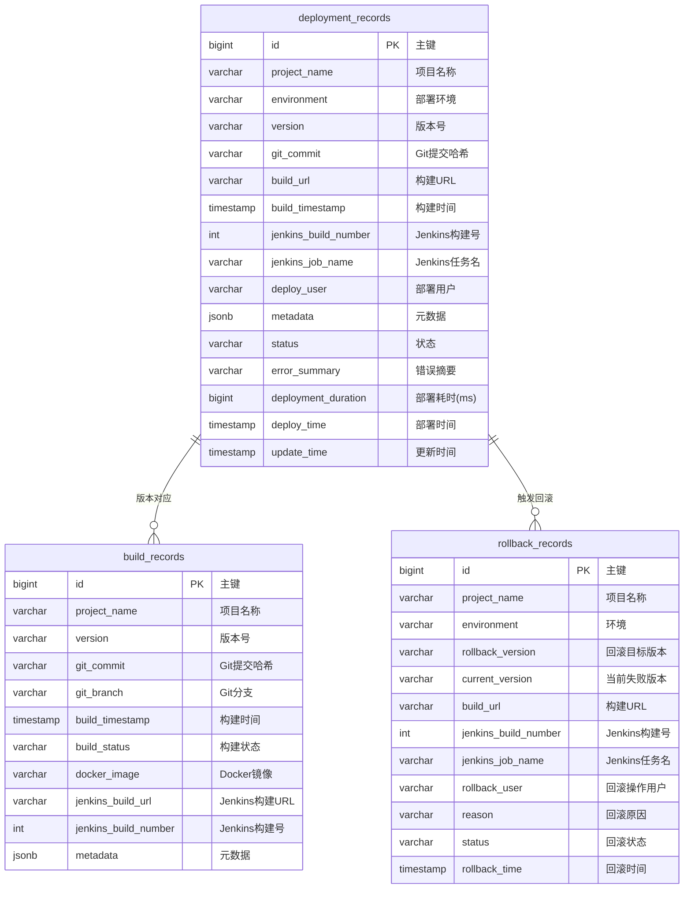

# Jenkins Pipeline 项目文档

## 项目概述

本项目包含4个Jenkins流水线，用于自动化构建、测试、安全扫描和部署Java应用。所有流水线基于共享库 [jenkins-pipeline-library](https://github.com/yakiv-liu/jenkins-pipeline-library.git) 实现。

## 系统架构

### 整体架构图



## 用户操作流程

```mermaid
flowchart TD
    Start([👨‍💻 开发者开始]) --> Login[🔐 登录 Jenkins]
    Login --> Dashboard[📊 访问 Jenkins 仪表板]
    
    Dashboard --> SelectJob[📋 选择 CI/CD 任务]
    SelectJob --> JobDetail[📝 查看任务详情]
    
    JobDetail --> BuildNow[🚀 立即构建]
    BuildNow --> Parameters[⚙️ 填写构建参数]
    
    subgraph Parameters [构建参数]
        P1[项目名称]
        P2[代码分支]
        P3[部署环境]
        P4[是否跳过依赖检查]
    end
    
    Parameters --> Confirm[✅ 确认开始构建]
    Confirm --> BuildProgress[⏳ 查看构建进度]
    
    BuildProgress --> MonitorStages[👀 监控各阶段状态]
    
    subgraph MonitorStages [监控构建阶段]
        M1[🔨 构建阶段]
        M2[🛡️ 安全扫描]
        M3[🚀 部署过程]
        M4[🔍 健康检查]
    end
    
    MonitorStages --> BuildResult{📊 构建结果}
    
    BuildResult -->|成功| ViewDeployed[🌐 访问部署的应用]
    BuildResult -->|失败| ViewLogs[📋 查看失败日志]
    
    ViewDeployed --> TestApp[🧪 测试应用功能]
    TestApp --> ReportIssue[🐛 报告问题]
    
    ViewLogs --> AnalyzeError[🔍 分析错误原因]
    AnalyzeError --> FixCode[🔧 修复代码]
    FixCode --> NewBuild[🔄 重新触发构建]
    
    NewBuild --> BuildProgress
    
    ReportIssue --> CreateTicket[🎫 创建问题工单]
    CreateTicket --> AssignFix[👨‍💻 分配修复任务]
    
    %% 运维人员流程
    Dashboard --> OpsView[🔍 运维监控视图]
    OpsView --> SystemHealth[❤️ 系统健康状态]
    OpsView --> DeploymentHistory[📊 部署历史]
    
    DeploymentHistory --> RollbackAction{🔄 需要回滚?}
    RollbackAction -->|是| ManualRollback[🎯 手动执行回滚]
    RollbackAction -->|否| ContinueMonitor[👀 继续监控]
    
    ManualRollback --> SelectVersion[📋 选择回滚版本]
    SelectVersion --> ConfirmRollback[✅ 确认回滚]
    ConfirmRollback --> RollbackProgress[⏳ 监控回滚进度]
    
    RollbackProgress --> RollbackResult{🔄 回滚结果}
    RollbackResult -->|成功| VerifyRecovery[✅ 验证服务恢复]
    RollbackResult -->|失败| EmergencyFix[🚨 紧急修复]
    
    VerifyRecovery --> End([✅ 流程完成])
    EmergencyFix --> End

    %% 样式
    classDef startEnd fill:#e3f2fd,stroke:#1565c0,rx:10px,ry:10px
    classDef userAction fill:#f3e5f5,stroke:#7b1fa2
    classDef decision fill:#e8f5e8,stroke:#2e7d32,rx:10px,ry:10px
    classDef subgraph fill:#fff3e0,stroke:#ef6c00
    classDef success fill:#c8e6c9,stroke:#2e7d32
    classDef failure fill:#ffcdd2,stroke:#c62828
    classDef opsAction fill:#e1f5fe,stroke:#0277bd

    class Start,End startEnd
    class Login,Dashboard,SelectJob,JobDetail,BuildNow,Confirm,BuildProgress,ViewDeployed,TestApp,ViewLogs,AnalyzeError,FixCode,NewBuild,ReportIssue,CreateTicket,AssignFix userAction
    class BuildResult,RollbackAction,RollbackResult decision
    class Parameters,MonitorStages subgraph
    class ViewDeployed,TestApp,VerifyRecovery success
    class ViewLogs,AnalyzeError,FixCode,EmergencyFix failure
    class OpsView,SystemHealth,DeploymentHistory,ManualRollback,SelectVersion,ConfirmRollback,RollbackProgress,ContinueMonitor opsAction
```

## 系统时序图

```mermaid
sequenceDiagram
    participant D as 开发者
    participant G as Git仓库
    participant JM as Jenkins Master
    participant JS as Jenkins Slave
    participant BT as BuildTools
    participant ST as SecurityTools
    participant DT as DeployTools
    participant DBT as DatabaseTools
    participant N as Nexus
    participant H as Harbor
    participant SQ as SonarQube
    participant TV as Trivy
    participant DB as 数据库
    participant AE as Ansible Engine
    participant STG as Staging环境
    participant PRE as Pre-Prod环境
    participant PRD as Prod环境

    Note over D,PRD: 🚀 Phase 1: 代码提交与触发
    
    D->>G: 1. git push origin master
    G->>JM: 2. Webhook 触发构建
    JM->>JM: 3. 解析 Jenkinsfile
    JM->>JM: 4. 加载共享库配置
    
    Note over D,PRD: 🔨 Phase 2: 构建与安全扫描
    
    JM->>JS: 5. 分配构建任务到 Slave
    JS->>BT: 6. 调用 BuildTools.mavenBuild()
    BT->>N: 7. 下载 Maven 依赖
    N-->>BT: 8. 返回依赖包
    BT->>BT: 9. Maven 编译打包
    BT->>BT: 10. Docker 镜像构建
    BT->>H: 11. 推送镜像到 Harbor
    H-->>BT: 12. 镜像推送成功
    
    par 并行安全扫描
        JS->>ST: 13. 调用 SecurityTools.fastSonarScan()
        ST->>SQ: 14. 执行代码质量分析
        SQ-->>ST: 15. 返回分析结果
        
        JS->>ST: 16. 调用 SecurityTools 进行 Trivy 扫描
        ST->>TV: 17. 扫描 Docker 镜像安全
        TV-->>ST: 18. 返回安全报告
        
        JS->>ST: 19. 执行依赖安全检查
        ST->>ST: 20. OWASP 依赖扫描
    end
    
    JS->>DBT: 21. 调用 DatabaseTools.recordBuild()
    DBT->>DB: 22. 记录构建信息
    DB-->>DBT: 23. 数据保存成功
    
    Note over D,PRD: 📊 Phase 3: 质量门检查
    
    JM->>JM: 24. 等待质量门结果
    SQ->>JM: 25. 发送质量门状态
    JM->>JM: 26. 评估质量门
    
    alt 质量门通过
        JM->>JM: 27. 继续部署流程
    else 质量门失败
        JM->>JM: 28. 标记构建为不稳定
        JM->>JM: 29. 继续部署（可配置）
    end
    
    Note over D,PRD: 🚀 Phase 4: 顺序部署
    
    loop 每个环境 [Staging, Pre-Prod, Prod]
        JM->>DT: 30. 调用 DeployTools.deployToEnvironmentWithAutoRollbackAndStatus()
        DT->>DBT: 31. 记录部署开始状态
        DBT->>DB: 32. 更新部署状态为 IN_PROGRESS
        DB-->>DBT: 33. 状态更新成功
        
        DT->>DT: 34. 准备 Ansible 环境
        DT->>AE: 35. 执行部署 Playbook
        AE->>STG: 36. 部署应用到目标环境
        STG-->>AE: 37. 部署完成
        
        DT->>DT: 38. 执行健康检查
        STG-->>DT: 39. 健康检查通过
        
        alt 部署成功
            DT->>DBT: 40. 更新部署状态为 SUCCESS
            DBT->>DB: 41. 记录部署成功
            DB-->>DBT: 42. 状态更新成功
        else 部署失败
            DT->>DBT: 43. 更新部署状态为 FAILED
            DBT->>DB: 44. 记录部署失败
            
            DT->>DBT: 45. 查询上一个成功版本
            DBT->>DB: 46. 获取可回滚版本
            DB-->>DBT: 47. 返回回滚版本信息
            
            DT->>AE: 48. 执行回滚 Playbook
            AE->>STG: 49. 回滚到上一个版本
            STG-->>AE: 50. 回滚完成
            
            DT->>DBT: 51. 记录回滚信息
            DBT->>DB: 52. 保存回滚记录
            DB-->>DBT: 53. 记录保存成功
            
            DT-->>JM: 54. 返回部署失败和回滚状态
            JM->>JM: 55. 跳过后续环境部署
            break
        end
    end
    
    Note over D,PRD: 📧 Phase 5: 结果通知
    
    alt 所有环境部署成功
        JM->>JM: 56. 发送成功通知
    else 有环境部署失败
        JM->>JM: 57. 发送失败通知（包含回滚信息）
    end
    
    JM->>D: 58. 邮件通知构建结果
```

## 数据库设计

### 数据表 UML 图



## 流水线列表

### 1. demo-helloworld-multibranch-PR
**类型**: 多分支流水线  
**触发条件**: 当有master或main分支的PR时通过webhook自动触发  
**Jenkinsfile**: [JenkinsfilePR.groovy](https://github.com/yakiv-liu/demo-helloworld/blob/main/jenkinsfiles/JenkinsfilePR.groovy)

#### Stages:
- **PR Info**: 显示PR信息，验证目标分支
- **Run PR Pipeline**: 执行PR流水线，包括：
  - 安全扫描（SonarQube、Trivy、依赖检查）
  - 构建和测试
  - 质量检查
  - 自动发布GitHub PR评论

#### 主要功能:
- 目标分支验证（仅允许master/main分支）
- 多种安全扫描强度配置（fast/standard/deep）
- 自动PR评论反馈
- 代码质量报告生成

---

### 2. demo-helloworld-master-branch-auto-deploy
**触发条件**: 当PR merge到master分支或有代码push到master分支时自动触发  
**Jenkinsfile**: [JenkinsfileMasterAutoDeploy.groovy](https://github.com/yakiv-liu/demo-helloworld/blob/main/jenkinsfiles/JenkinsfileMasterAutoDeploy.groovy)

#### Stages:
- **Initialize & Validation**: 初始化和参数验证
- **Checkout & Setup**: 代码检出和环境设置
- **Build & Security Scan**: 
  - **Build**: Maven构建、Docker镜像构建、Trivy安全扫描、镜像推送
  - **Security Scan**: SonarQube扫描、依赖检查（并行执行）
- **Quality Gate**: SonarQube质量门检查
- **Sequential Deployment**: 顺序部署到staging → pre-prod环境

#### 主要功能:
- 自动版本号生成（时间戳格式）
- 安全扫描和质量门控
- 顺序部署到测试环境
- 自动回滚机制
- 数据库部署记录

---

### 3. demo-helloworld-main-branch-auto-deploy
**触发条件**: 当PR merge到main分支或有代码push到main分支时自动触发  
**Jenkinsfile**: [JenkinsfileMainAutoDeploy.groovy](https://github.com/yakiv-liu/demo-helloworld/blob/main/jenkinsfiles/JenkinsfileMainAutoDeploy.groovy)

#### Stages:
- **Initialize & Validation**: 初始化和参数验证
- **Checkout & Setup**: 代码检出和环境设置
- **Build & Security Scan**: 
  - **Build**: Maven构建、Docker镜像构建、Trivy安全扫描、镜像推送
  - **Security Scan**: SonarQube扫描、依赖检查（并行执行）
- **Quality Gate**: SonarQube质量门检查
- **Sequential Deployment**: 顺序部署到staging → pre-prod → prod环境

#### 主要功能:
- 与master分支流水线类似，但部署到所有环境（包括生产环境）
- 完整的CI/CD流程
- 生产环境自动部署

---

### 4. helloworld-multi-mode-pipeline
**类型**: 手动触发流水线  
**Jenkinsfile**: [JenkinsfileManual.groovy](https://github.com/yakiv-liu/projectPipelines/blob/master/demo-helloworld/JenkinsfileManual.groovy)

#### 构建模式:
- **full-pipeline**: 完整流水线（构建+部署）- 自动生成版本号
- **build-only**: 仅构建（推送Docker镜像到仓库）- 自动生成版本号
- **deploy-only**: 仅部署（从数据库选择部署版本）

#### Stages (根据模式不同):
- **Initialize & Validation**: 初始化和参数验证
- **Checkout & Setup**: 代码检出和环境设置
- **Build & Security Scan** (full-pipeline/build-only模式):
  - Maven构建、Docker镜像构建、安全扫描、镜像推送
- **Deploy** (full-pipeline/deploy-only模式):
  - 部署到指定环境（staging/pre-prod/prod）
  - 支持版本选择和自动回滚

#### 主要功能:
- 灵活的构建模式选择
- 数据库版本管理
- 手动部署版本选择
- 支持单个环境部署
- 配置化项目参数

---

## 共享库功能

### 核心组件

#### 配置管理 (Config.groovy)
- 统一的配置管理
- 环境变量管理
- 邮件模板配置

#### 构建工具 (BuildTools.groovy)
- Maven构建
- Docker镜像构建和推送
- Trivy安全扫描

#### 安全工具 (SecurityTools.groovy)
- SonarQube代码扫描
- 依赖安全检查
- 多强度扫描配置

#### 部署工具 (DeployTools.groovy)
- Ansible部署
- 自动回滚机制
- 健康检查
- 多环境支持

#### 数据库工具 (DatabaseTools.groovy)
- 构建记录存储
- 部署历史管理
- 版本查询

#### 通知工具 (NotificationTools.groovy)
- 邮件通知
- 构建状态报告
- 自定义模板

### 环境配置

#### 基础设施
- **Nexus**: 192.168.233.8:8081
- **Harbor**: 192.168.233.9:80/mlp  
- **SonarQube**: 192.168.233.10:9000
- **Trivy**: 192.168.233.9:8084
- **数据库**: PostgreSQL (192.168.233.8:5432)

#### 部署环境
- **staging**: 192.168.233.8
- **pre-prod**: 192.168.233.9  
- **prod**: 192.168.233.10

## 特性

### 自动回滚
- 部署失败时自动回滚到上一个成功版本
- 数据库记录回滚操作
- 健康检查验证

### 安全扫描
- 代码质量分析（SonarQube）
- 容器安全扫描（Trivy）
- 依赖漏洞检查
- 多强度扫描模式

### 数据库集成
- 构建记录存储
- 部署历史追踪
- 版本管理
- 回滚记录

### 通知系统
- 邮件通知
- 构建状态报告
- GitHub PR评论
- 自定义模板

## 使用说明

### 自动流水线
- PR流水线：创建PR到master/main分支时自动触发
- 自动部署流水线：代码合并或推送到对应分支时自动触发

### 手动流水线
1. 选择构建模式：
   - full-pipeline: 完整构建部署
   - build-only: 仅构建镜像
   - deploy-only: 仅部署现有版本
2. 选择目标环境
3. 配置项目参数
4. 执行流水线

### 参数配置
所有流水线支持以下参数：
- 项目名称
- 应用端口
- 邮箱接收人
- 跳过依赖检查
- 环境选择
- 版本选择（deploy-only模式）

## 依赖要求
- Jenkins with Pipeline plugin
- Docker
- Maven
- Ansible
- PostgreSQL数据库
- SonarQube
- Trivy
- Harbor/Nexus