# Jenkins Pipeline 项目文档

## 项目概述

本项目包含4个Jenkins流水线，用于自动化构建、测试、安全扫描和部署Java应用。所有流水线基于共享库 [jenkins-pipeline-library](https://github.com/yakiv-liu/jenkins-pipeline-library.git) 实现。

## 系统架构

### 整体架构图

```mermaid
graph TB
    subgraph "👥 用户与触发层"
        DEV[👨‍💻 开发者<br/>Git Push]
        GIT[📚 Git仓库<br/>Webhook触发]
        OPS[👨‍💼 运维工程师<br/>监控与干预]
    end
    
    subgraph "🚀 CI/CD 控制平面"
        subgraph "⚙️ Jenkins 主控"
            JM[Jenkins Master<br/>Pipeline 编排器]
            JP[Jenkins Pipeline<br/>流水线定义]
            LIB[Jenkins共享库<br/>可复用工具类]
        end
        
        subgraph "🛠️ 工具类库"
            BT[BuildTools<br/>Maven/Docker构建]
            DT[DeployTools<br/>部署与回滚]
            ST[SecurityTools<br/>安全扫描]
            DBT[DatabaseTools<br/>数据持久化]
        end
    end
    
    subgraph "🔨 构建执行环境"
        SLAVE[Jenkins Slave<br/>构建执行节点]
        DOCKER[🐳 Docker Engine<br/>容器运行时]
        MAVEN[🍃 Maven<br/>Java构建工具]
    end
    
    subgraph "📦 制品仓库"
        NEXUS[📁 Nexus<br/>Maven制品仓库]
        HARBOR[🏗️ Harbor<br/>Docker镜像仓库]
    end
    
    subgraph "🔒 安全与质量门禁"
        SONAR[📊 SonarQube<br/>代码质量分析]
        TRIVY[🛡️ Trivy<br/>容器安全扫描]
        DEPCHECK[📋 依赖检查<br/>OWASP DC]
    end
    
    subgraph "🗄️ 数据持久化"
        DB[🐘 PostgreSQL<br/>部署记录数据库]
        DB_DEPLOY[部署记录表]
        DB_BUILD[构建记录表]
        DB_ROLLBACK[回滚记录表]
    end
    
    subgraph "🎯 部署目标环境"
        STAGING[🌱 Staging环境<br/>192.168.233.8]
        PREPROD[🔄 Pre-Prod环境<br/>192.168.233.9]
        PROD[🚀 Prod环境<br/>192.168.233.10]
    end
    
    subgraph "🔄 部署工具链"
        ANSIBLE[🔄 Ansible<br/>自动化部署]
        PLAYBOOK[部署剧本<br/>deploy-with-rollback.yml]
        ROLLBACK[回滚剧本<br/>rollback.yml]
    end
    
    %% ========== 核心CI流程 ==========
    DEV -->|Git Push| GIT
    GIT -->|Webhook触发| JM
    JM -->|加载流水线| JP
    JP -->|调用工具类| LIB
    LIB -->|构建任务| BT
    LIB -->|部署任务| DT
    LIB -->|安全扫描| ST
    LIB -->|数据记录| DBT
    
    %% ========== 构建阶段 ==========
    BT -->|分配任务| SLAVE
    SLAVE -->|Maven构建| MAVEN
    MAVEN -->|下载依赖| NEXUS
    SLAVE -->|Docker构建| DOCKER
    DOCKER -->|推送镜像| HARBOR
    
    %% ========== 安全扫描阶段 ==========
    ST -->|代码质量扫描| SONAR
    ST -->|镜像安全扫描| TRIVY
    ST -->|依赖漏洞扫描| DEPCHECK
    HARBOR -->|触发扫描| TRIVY
    
    %% ========== 质量门禁 ==========
    SONAR -->|质量门结果| JM
    TRIVY -->|安全报告| JM
    DEPCHECK -->|漏洞报告| JM
    
    %% ========== 数据记录 ==========
    DBT -->|连接数据库| DB
    BT -->|记录构建信息| DBT
    DT -->|记录部署信息| DBT
    
    %% ========== 部署阶段 ==========
    DT -->|准备部署| ANSIBLE
    ANSIBLE -->|执行部署| PLAYBOOK
    PLAYBOOK -->|部署到| STAGING
    
    %% ========== 顺序部署流程 ==========
    STAGING -->|健康检查通过| PREPROD
    PREPROD -->|健康检查通过| PROD
    
    %% ========== 自动回滚机制 ==========
    STAGING -.->|部署失败| ROLLBACK
    PREPROD -.->|部署失败| ROLLBACK
    PROD -.->|部署失败| ROLLBACK
    ROLLBACK -->|查询历史版本| DB
    DB -->|返回成功版本| ROLLBACK
    ROLLBACK -->|执行回滚| STAGING
    
    %% ========== 监控与反馈 ==========
    PROD -->|应用监控| OPS
    OPS -->|手动干预| JM
    
    classDef user fill:#e3f2fd,stroke:#1565c0,stroke-width:2px
    classDef control fill:#f3e5f5,stroke:#7b1fa2,stroke-width:2px
    classDef tools fill:#e8f5e8,stroke:#2e7d32,stroke-width:2px
    classDef execution fill:#fff3e0,stroke:#ef6c00,stroke-width:2px
    classDef artifact fill:#fce4ec,stroke:#ad1457,stroke-width:2px
    classDef security fill:#ffebee,stroke:#c62828,stroke-width:2px
    classDef data fill:#e1f5fe,stroke:#0277bd,stroke-width:2px
    classDef target fill:#f3e5f5,stroke:#7b1fa2,stroke-width:2px
    classDef deploy fill:#e8f5e8,stroke:#2e7d32,stroke-width:2px
    
    class DEV,GIT,OPS user
    class JM,JP,LIB control
    class BT,DT,ST,DBT tools
    class SLAVE,DOCKER,MAVEN execution
    class NEXUS,HARBOR artifact
    class SONAR,TRIVY,DEPCHECK security
    class DB,DB_DEPLOY,DB_BUILD,DB_ROLLBACK data
    class STAGING,PREPROD,PROD target
    class ANSIBLE,PLAYBOOK,ROLLBACK deploy
```

## 工作流程

```mermaid
graph TD
    A[代码提交] --> B[Webhook 触发]
    B --> C[Jenkins Pipeline 启动]
    C --> D[初始化阶段]
    D --> E[代码检出]
    E --> F[构建阶段]
    F --> G[安全扫描阶段]
    G --> H{质量门检查}
    H -->|通过| I[部署阶段]
    H -->|失败| J[标记为不稳定]
    J --> I
    I --> K{Staging 部署结果}
    K -->|成功| L[部署 Pre-Prod]
    K -->|失败| M[Staging 回滚]
    L --> N{Pre-Prod 健康检查}
    N -->|成功| O[部署 Prod]
    N -->|失败| P[Pre-Prod 回滚]
    O --> Q{Prod 健康检查}
    Q -->|成功| R[部署成功]
    Q -->|失败| S[Prod 回滚]
    M --> T[构建失败]
    P --> T
    S --> T
    R --> U[发送成功通知]
    T --> V[发送失败通知]
    U --> W[流程完成]
    V --> X[流程终止]
    
    F --> Y[记录构建信息]
    I --> Z[记录部署状态]
    M --> AA[记录回滚信息]
    P --> AA
    S --> AA
```

## 系统时序图

```mermaid
sequenceDiagram
    participant 👨‍💻 as 开发者
    participant 📚 as Git仓库
    participant ⚙️ as Jenkins Pipeline
    participant 🛠️ as BuildTools
    participant 🛡️ as SecurityTools
    participant 🚀 as DeployTools
    participant 🗄️ as DatabaseTools
    participant 📦 as Nexus/Harbor
    participant 🌐 as 目标环境

    Note over 👨‍💻,🌐: 🚀 Master 分支自动部署流程

    👨‍💻->>📚: 📥 推送代码到 master 分支
    📚->>⚙️: 🔔 Webhook 触发构建
    ⚙️->>⚙️: 🔧 初始化配置和参数验证
    
    ⚙️->>🛠️: 📋 调用构建流程
    🛠️->>📦: 📥 Maven 构建和依赖下载
    🛠️->>🛠️: 🐳 Docker 镜像构建
    🛠️->>🛡️: 🔒 Trivy 安全扫描
    🛠️->>📦: 📤 推送镜像到 Harbor
    
    ⚙️->>🛡️: 📊 并行安全扫描
    🛡️->>🛡️: 📈 SonarQube 代码质量分析
    🛡️->>🛡️: 🔍 依赖安全检查（可选）
    
    ⚙️->>🗄️: 💾 记录构建信息到数据库
    
    ⚙️->>⚙️: ⏳ 等待质量门结果
    
    loop 🔄 顺序部署环境
        ⚙️->>🚀: 🎯 部署到环境
        🚀->>🗄️: 📝 记录部署开始
        🚀->>🌐: 🚀 执行 Ansible 部署
        🚀->>🌐: 🔍 健康检查
        
        alt ✅ 部署成功
            🚀->>🗄️: ✅ 更新部署状态为成功
        else ❌ 部署失败
            🚀->>🗄️: ❌ 更新部署状态为失败
            🚀->>🗄️: 🔍 查询上一个成功版本
            🚀->>🌐: 🔙 执行自动回滚
            🚀->>🗄️: 📝 记录回滚信息
            🚀->>⚙️: 🚨 返回部署失败状态
            ⚙️->>⚙️: ⏹️ 跳过后续环境部署
        end
    end
    
    ⚙️->>👨‍💻: 📧 发送构建结果通知
    
    Note over 👨‍💻,🌐: 🎉 流程完成
```

## 数据库设计

### 数据表 UML 图

```mermaid
erDiagram
    %% 部署记录表 - 核心表
    deployment_records {
        bigint id PK "主键"
        varchar project_name "项目名称"
        varchar environment "部署环境"
        varchar version "版本号"
        varchar git_commit "Git提交哈希"
        varchar build_url "构建URL"
        timestamp build_timestamp "构建时间"
        int jenkins_build_number "Jenkins构建号"
        varchar jenkins_job_name "Jenkins任务名"
        varchar deploy_user "部署用户"
        jsonb metadata "元数据"
        varchar status "状态"
        varchar error_summary "错误摘要"
        bigint deployment_duration "部署耗时(ms)"
        timestamp deploy_time "部署时间"
        timestamp update_time "更新时间"
    }

    %% 构建记录表
    build_records {
        bigint id PK "主键"
        varchar project_name "项目名称"
        varchar version "版本号"
        varchar git_commit "Git提交哈希"
        varchar git_branch "Git分支"
        timestamp build_timestamp "构建时间"
        varchar build_status "构建状态"
        varchar docker_image "Docker镜像"
        varchar jenkins_build_url "Jenkins构建URL"
        int jenkins_build_number "Jenkins构建号"
        jsonb metadata "元数据"
    }

    %% 回滚记录表
    rollback_records {
        bigint id PK "主键"
        varchar project_name "项目名称"
        varchar environment "环境"
        varchar rollback_version "回滚目标版本"
        varchar current_version "当前失败版本"
        varchar build_url "构建URL"
        int jenkins_build_number "Jenkins构建号"
        varchar jenkins_job_name "Jenkins任务名"
        varchar rollback_user "回滚操作用户"
        varchar reason "回滚原因"
        varchar status "回滚状态"
        timestamp rollback_time "回滚时间"
    }

    %% 表关系定义
    deployment_records ||--o{ build_records : "版本对应"
    deployment_records ||--o{ rollback_records : "触发回滚"
```

## 流水线列表

### 1. demo-helloworld-multibranch-PR
**类型**: 多分支流水线  
**触发条件**: 当有master或main分支的PR时通过webhook自动触发  
**Jenkinsfile**: [JenkinsfilePR.groovy](https://github.com/yakiv-liu/demo-helloworld/blob/main/jenkinsfiles/JenkinsfilePR.groovy)

#### Stages:
- **PR Info**: 显示PR信息，验证目标分支
- **Run PR Pipeline**: 执行PR流水线，包括：
  - 安全扫描（SonarQube、Trivy、依赖检查）
  - 构建和测试
  - 质量检查
  - 自动发布GitHub PR评论

#### 主要功能:
- 目标分支验证（仅允许master/main分支）
- 多种安全扫描强度配置（fast/standard/deep）
- 自动PR评论反馈
- 代码质量报告生成

---

### 2. demo-helloworld-master-branch-auto-deploy
**触发条件**: 当PR merge到master分支或有代码push到master分支时自动触发  
**Jenkinsfile**: [JenkinsfileMasterAutoDeploy.groovy](https://github.com/yakiv-liu/demo-helloworld/blob/main/jenkinsfiles/JenkinsfileMasterAutoDeploy.groovy)

#### Stages:
- **Initialize & Validation**: 初始化和参数验证
- **Checkout & Setup**: 代码检出和环境设置
- **Build & Security Scan**: 
  - **Build**: Maven构建、Docker镜像构建、Trivy安全扫描、镜像推送
  - **Security Scan**: SonarQube扫描、依赖检查（并行执行）
- **Quality Gate**: SonarQube质量门检查
- **Sequential Deployment**: 顺序部署到staging → pre-prod环境

#### 主要功能:
- 自动版本号生成（时间戳格式）
- 安全扫描和质量门控
- 顺序部署到测试环境
- 自动回滚机制
- 数据库部署记录

---

### 3. demo-helloworld-main-branch-auto-deploy
**触发条件**: 当PR merge到main分支或有代码push到main分支时自动触发  
**Jenkinsfile**: [JenkinsfileMainAutoDeploy.groovy](https://github.com/yakiv-liu/demo-helloworld/blob/main/jenkinsfiles/JenkinsfileMainAutoDeploy.groovy)

#### Stages:
- **Initialize & Validation**: 初始化和参数验证
- **Checkout & Setup**: 代码检出和环境设置
- **Build & Security Scan**: 
  - **Build**: Maven构建、Docker镜像构建、Trivy安全扫描、镜像推送
  - **Security Scan**: SonarQube扫描、依赖检查（并行执行）
- **Quality Gate**: SonarQube质量门检查
- **Sequential Deployment**: 顺序部署到staging → pre-prod → prod环境

#### 主要功能:
- 与master分支流水线类似，但部署到所有环境（包括生产环境）
- 完整的CI/CD流程
- 生产环境自动部署

---

### 4. helloworld-multi-mode-pipeline
**类型**: 手动触发流水线  
**Jenkinsfile**: [JenkinsfileManual.groovy](https://github.com/yakiv-liu/projectPipelines/blob/master/demo-helloworld/JenkinsfileManual.groovy)

#### 构建模式:
- **full-pipeline**: 完整流水线（构建+部署）- 自动生成版本号
- **build-only**: 仅构建（推送Docker镜像到仓库）- 自动生成版本号
- **deploy-only**: 仅部署（从数据库选择部署版本）

#### Stages (根据模式不同):
- **Initialize & Validation**: 初始化和参数验证
- **Checkout & Setup**: 代码检出和环境设置
- **Build & Security Scan** (full-pipeline/build-only模式):
  - Maven构建、Docker镜像构建、安全扫描、镜像推送
- **Deploy** (full-pipeline/deploy-only模式):
  - 部署到指定环境（staging/pre-prod/prod）
  - 支持版本选择和自动回滚

#### 主要功能:
- 灵活的构建模式选择
- 数据库版本管理
- 手动部署版本选择
- 支持单个环境部署
- 配置化项目参数

---

## 共享库功能

### 核心组件

#### 配置管理 (Config.groovy)
- 统一的配置管理
- 环境变量管理
- 邮件模板配置

#### 构建工具 (BuildTools.groovy)
- Maven构建
- Docker镜像构建和推送
- Trivy安全扫描

#### 安全工具 (SecurityTools.groovy)
- SonarQube代码扫描
- 依赖安全检查
- 多强度扫描配置

#### 部署工具 (DeployTools.groovy)
- Ansible部署
- 自动回滚机制
- 健康检查
- 多环境支持

#### 数据库工具 (DatabaseTools.groovy)
- 构建记录存储
- 部署历史管理
- 版本查询

#### 通知工具 (NotificationTools.groovy)
- 邮件通知
- 构建状态报告
- 自定义模板

### 环境配置

#### 基础设施
- **Nexus**: 192.168.233.8:8081
- **Harbor**: 192.168.233.9:80/mlp  
- **SonarQube**: 192.168.233.10:9000
- **Trivy**: 192.168.233.9:8084
- **数据库**: PostgreSQL (192.168.233.8:5432)

#### 部署环境
- **staging**: 192.168.233.8
- **pre-prod**: 192.168.233.9  
- **prod**: 192.168.233.10

## 特性

### 自动回滚
- 部署失败时自动回滚到上一个成功版本
- 数据库记录回滚操作
- 健康检查验证

### 安全扫描
- 代码质量分析（SonarQube）
- 容器安全扫描（Trivy）
- 依赖漏洞检查
- 多强度扫描模式

### 数据库集成
- 构建记录存储
- 部署历史追踪
- 版本管理
- 回滚记录

### 通知系统
- 邮件通知
- 构建状态报告
- GitHub PR评论
- 自定义模板

## 使用说明

### 自动流水线
- PR流水线：创建PR到master/main分支时自动触发
- 自动部署流水线：代码合并或推送到对应分支时自动触发

### 手动流水线
1. 选择构建模式：
   - full-pipeline: 完整构建部署
   - build-only: 仅构建镜像
   - deploy-only: 仅部署现有版本
2. 选择目标环境
3. 配置项目参数
4. 执行流水线

### 参数配置
所有流水线支持以下参数：
- 项目名称
- 应用端口
- 邮箱接收人
- 跳过依赖检查
- 环境选择
- 版本选择（deploy-only模式）

## 依赖要求
- Jenkins with Pipeline plugin
- Docker
- Maven
- Ansible
- PostgreSQL数据库
- SonarQube
- Trivy
- Harbor/Nexus